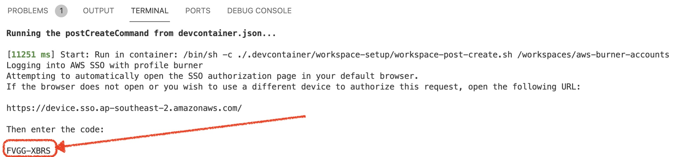

# hackathon-atlantis
2022 hackathon, using [Atlantis](https://www.runatlantis.io/) to make terraform deploys easier

## Overview

This is a proof of concept that was done as part of [Canva's](https://www.canva.com/) 2022 "Design for Change" hackathon.  Those internal to Canva can see the project submission page [here](https://canvadev.atlassian.net/wiki/spaces/HACK/pages/2718828978/Better+Infra+Changes+with+Atlantis).  

The PoC tackles the problem of:

    - Trying to keep terraform state and git `main` branch in sync
    - Limiting the overheads on those that have to approve and have permissions to apply aspects of terraform change

This PoC was originally stood up and operated in a Canva AWS Burner Account.  It leverages the following components:

    - EKS cluster to house Atlantis server
      - Ingress via ALB (webhooks, links to Atlantis runs)
      - Integration with demonstration roles 
      - IRSA for allowing the Atlantis server pods access to view (all) infra in Burner Account
    - Helm chart `values.yaml` to configure [Atlantis server](https://github.com/runatlantis/atlantis) for our use
      - Has a customized "workflow" that allows us to hook in Canva specific requirements
    - GitHub Application
    - GitHub Container Registry for Customized Atlantis server image
    - VSCode Remote Containers development image

### Custom image server

The custom Atlantis server includes a [python script](docker/python/role_checker.py) that hooks into the Atlantis Plan/Apply workflows.  It is responsible for checking the role that the user is assigned and making sure they it exists and they can assume it.  It is largely a standin for the permission engine

## Setup

1. Create Kubernetes Cluster (terragrunt coming soon)
2. [Configure and install Atlantis helm chart](helm/atlantis/README.md)
3. Create and/or Integration with GitHub App

## Development

Instructions for continuing development within this repo

### Custom Atlantis Image

See instructions [here](docker/README.md)
### Visual Studio Code Support

If you are using [Visual Studio Code](https://code.visualstudio.com/) with the [Remote Containers Extension](https://marketplace.visualstudio.com/items?itemName=ms-vscode-remote.remote-containers), you don't need to install anything locally to be able to contribute or develop in this repo.

To run VSCode:

1. Check the [prerequisites](#prereq)
2. If using burner accounts, setup per [these instructions](#burner)
3. Open VS Code from the root of the `hackathon-atlantis` repository and when prompted indicate that you want to "open the folder in a container".

#### <a name="prereq"></a>Prerequisites

1. Currently only VSCode running on MacOS (with Docker for Mac) is supported
2. You must have a `~/.aws` directory in your home directory
   
### <a name="burner"></a>Burner Account Support

VSCode containers can automatically integrate with your Canva AWS Burner Account.  To activate it automatically you must do the following:

1. Before opening VSCode, setup your burner account config with:
```
infra burner --setup
```
2. Set the following environment variables in your host environment

    | Environment Variable   | Description    |
    |--------------- | --------------- |
    | AWS_PROFILE    | This should be set to the name of the profile that represents the proper role assumption for the default account you wish to target.  This should also be present in your `~/.aws/config-burner` file

3. Open VSCode from within a container as described above
4. Once the container is finished building, you will likely get a prompt from the SSO login mechanism that will look something like the image that follows.  You can <kbd>Command</kbd> + click on the URL to open it on the host and enter the highlighted code to login your container instance (yours will be unique to your invocation):
    

Once the devcontainer is initialized, from the Visual Studio Code terminal you will be able to run all the commands outlined for creating documentation or contributing to the repo.
